# ??? Store Backend - Architecture & Functionality Diagrams

## ?? System Architecture Overview

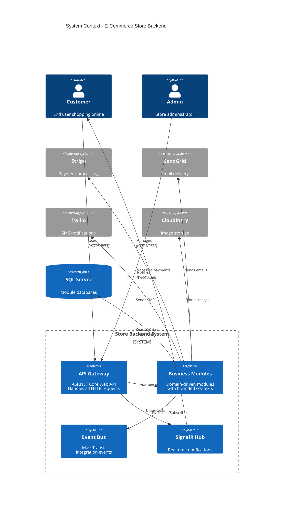

## ?? Module Architecture (C4 Container)

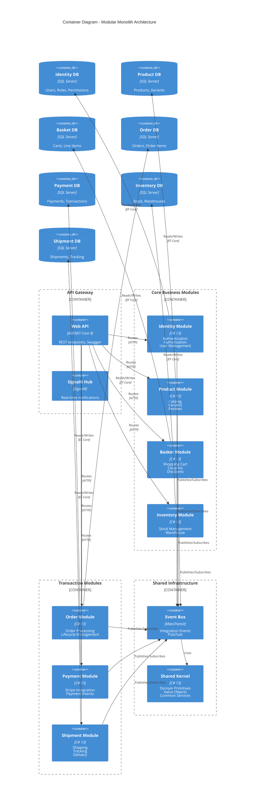

## ?? Order Placement Flow (Sequence Diagram)

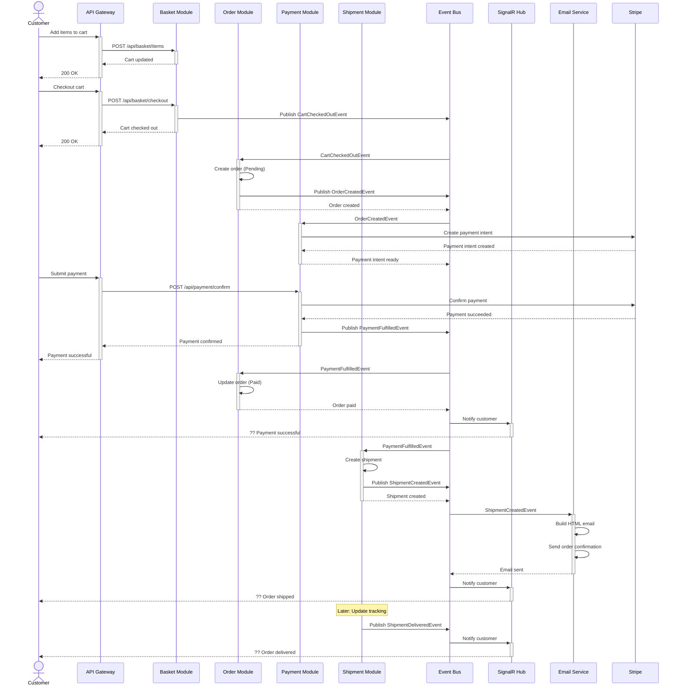

## ??? DDD Layered Architecture (Per Module)

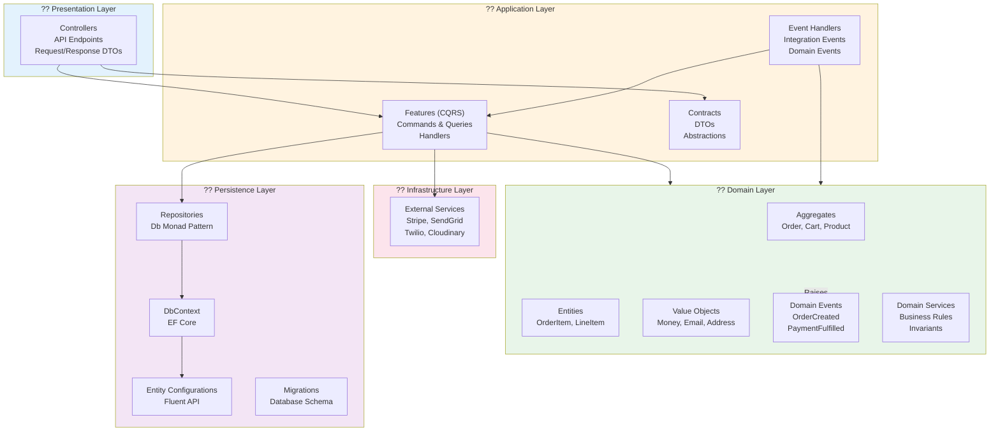

## ?? Authentication & Authorization Flow

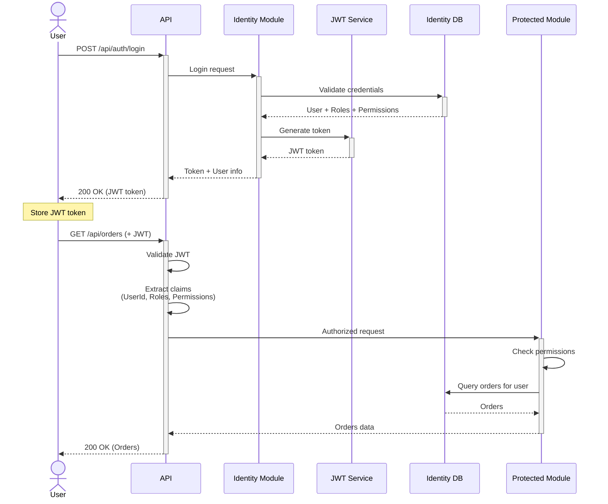

## ?? CQRS Pattern Implementation

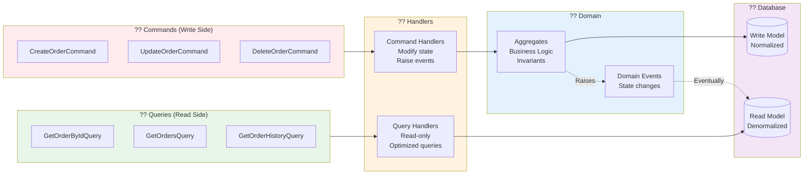

## ?? Event-Driven Communication

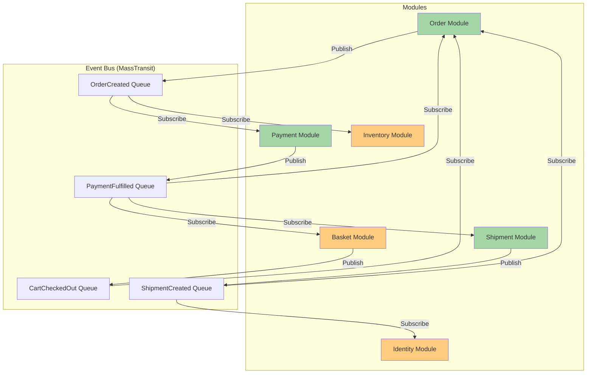

## ?? Functional Programming with LanguageExt

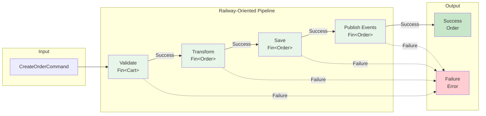

## ?? Functional Error Handling

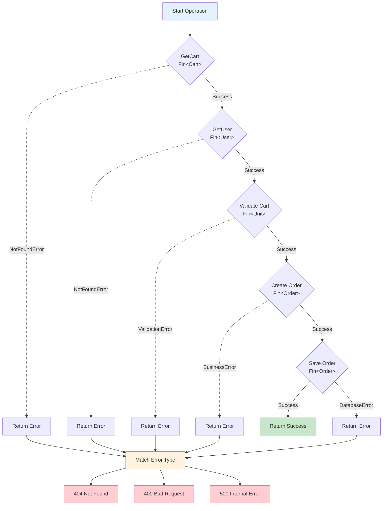

## ?? Database Per Module Pattern

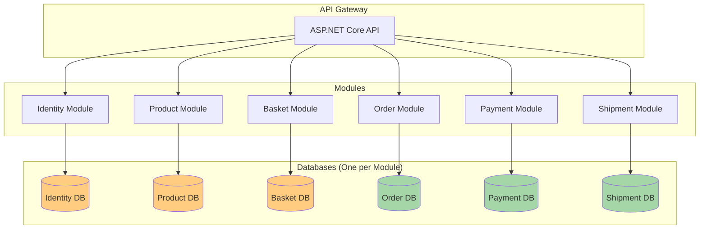

## ?? CI/CD Pipeline

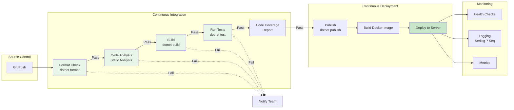

---

## ?? How to Use These Diagrams

### **In GitHub:**
- Mermaid diagrams render automatically in `.md` files
- View them directly in your repository

### **Export as Image:**
```bash
# Using Mermaid CLI
npm install -g @mermaid-js/mermaid-cli
mmdc -i docs/ARCHITECTURE_DIAGRAM.md -o docs/architecture.png
```

### **In Documentation Sites:**
- Copy to Confluence, Notion, GitBook
- Diagrams auto-render in most platforms

### **In Presentations:**
- Screenshot the rendered diagrams
- Or use Mermaid Live Editor: https://mermaid.live

---

**?? These diagrams comprehensively describe your Store Backend's architecture and functionality using industry-standard notation!**
