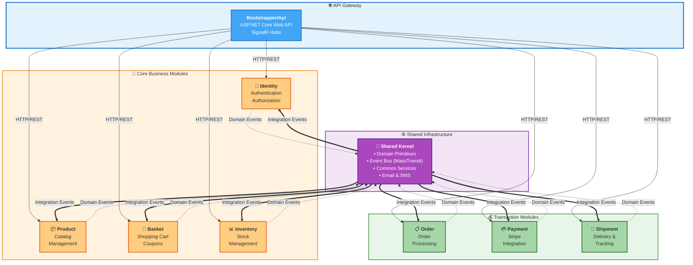

# 🛍️ Store Backend - E-Commerce Platform

[](https://dotnet.microsoft.com/)
[](https://docs.microsoft.com/en-us/dotnet/csharp/)
[](https://github.com/louthy/language-ext)
[](LICENSE)

A modern, enterprise-grade e-commerce backend built with **Domain-Driven Design (DDD)**, **Functional Programming**, and **Event-Driven Architecture** using .NET 9 and C# 13.

## 🎯 Key Features

- ✅ **Domain-Driven Design (DDD)** - Modular monolith with bounded contexts
- 🔧 **Functional Core** - Leveraging LanguageExt for pure functional programming
- 📡 **Event-Driven Architecture** - Using MassTransit for reliable messaging
- 🔔 **Real-Time Notifications** - SignalR hubs for instant updates
- 💳 **Payment Integration** - Stripe payment processing
- 📧 **Email System** - SendGrid integration with HTML templates
- 📦 **Shipping Management** - Dynamic shipping cost calculation
- 🔐 **JWT Authentication** - Role and permission-based authorization
- 🎭 **CQRS Pattern** - Command Query Responsibility Segregation
- 🏛️ **Vertical Slice Architecture** - Feature-focused organization

## 🏗️ Architecture Overview

This project follows a **modular monolith architecture** with strict bounded contexts, implementing DDD principles with a functional programming approach.



### 📦 Modules (Bounded Contexts)

| Module | Responsibility | Domain Entities |
|--------|---------------|-----------------|
| **Identity** | User management, authentication, authorization | `User`, `Role`, `Permission` |
| **Product** | Product catalog, variants, reviews | `Product`, `ColorVariant`, `SizeVariant` |
| **Basket** | Shopping cart, coupons, line items | `Cart`, `LineItem`, `Coupon` |
| **Inventory** | Stock management, warehouse operations | `Inventory`, `Stock` |
| **Order** | Order processing, order lifecycle | `Order`, `OrderItem` |
| **Payment** | Payment processing, Stripe integration | `Payment`, `PaymentIntent` |
| **Shipment** | Shipping, tracking, delivery | `Shipment`, `TrackingCode` |
| **Shared** | Cross-cutting concerns, infrastructure | Value Objects, Common Services |

## 🚀 Functional Programming with LanguageExt

This project heavily utilizes [LanguageExt](https://github.com/louthy/language-ext) to bring functional programming concepts to C#:

### Core Functional Patterns

#### 1️⃣ **Monadic Error Handling with `Fin<T>`**

Real example from the Order module:

```csharp
// Order.Domain.Models.Order.cs
public class Order : Aggregate<OrderId>
{
    public Fin<Order> MarkAsPaid(PaymentId paymentId, DateTime dateTime)
    {
        return OrderStatus.CanTransitionTo(OrderStatus.Paid).Map(_ =>
        {
            var oldStatus = OrderStatus;
            
            PaymentId = paymentId;
            OrderStatus = OrderStatus.Paid;
            PaidAt = dateTime;
            
            // Raise domain events
            AddDomainEvent(new OrderStatusChangedDomainEvent(
                Id, oldStatus, OrderStatus.Paid, dateTime));
            
            AddDomainEvent(new OrderPaidDomainEvent(
                Id, paymentId, dateTime));
            
            return this;
        });
    }
}
```

#### 2️⃣ **Railway-Oriented Programming**

Real example from the Cart module:

```csharp
// Basket.Domain.Models.Cart.cs
public class Cart : Aggregate<CartId>
{
    public Fin<Cart> AddDiscount(CouponId couponId, Discount discount)
    {
        // Validation
        if (CouponIds.Contains(couponId)) 
            return FinFail<Cart>(InvalidOperationError.New("Coupon is already applied."));
        
        // Apply discount
        CouponIds.Add(couponId);
        Discounts.Add(discount);
        TotalDiscount = RecalculateTotalDiscount();
        ShipmentCost = UpdateShippingCost();
        
        return this;
    }
    
    public Fin<Cart> UpdateLineItemQuantity(ColorVariantId colorVariantId, Guid sizeVariant, int quantity)
    {
        if (quantity <= 0)
        {
            return DeleteLineItem(colorVariantId); // Railway switch
        }
        
        LineItems = LineItems.Select(li =>
            li.ColorVariantId.Value == colorVariantId.Value && li.SizeVariantId == sizeVariant
                ? li.UpdateQuantity(quantity)
                : li).ToList();
                
        TotalSub = GetSubTotal(LineItems);
        ShipmentCost = UpdateShippingCost();
        
        return this;
    }
}
```

#### 3️⃣ **Option Type for Null Safety**

Real example from the Order module showing `Option<DateTime>` usage:

```csharp
// Order.Domain.Models.Order.cs
public class Order : Aggregate<OrderId>
{
    // Using Option<T> for optional dates
    [NotMapped]
    public Option<DateTime> PaidAt { get; private set; } = Option<DateTime>.None;
    
    [NotMapped]
    public Option<DateTime> ShippedAt { get; private set; } = Option<DateTime>.None;
    
    [NotMapped]
    public Option<DateTime> DeliveredAt { get; private set; } = Option<DateTime>.None;
    
    // EF Core mapping helper
    public DateTime? _paidAt
    {
        get => PaidAt.Match<DateTime?>(date => date, () => null);
        set => PaidAt = Optional(value);
    }
}
```

#### 4️⃣ **Functional Database Operations with Db Monad**

Real example from the Shared infrastructure:

```csharp
// Shared.Persistence.Db.Monad.Db.Access.cs
public static Db<Ctx, A> GetUpdateEntity<Ctx, A>(
    Expression<Func<A, bool>> predicate,
    NotFoundError error,
    Func<QueryOptions<A>, QueryOptions<A>>? fn = null,
    params Func<A, Fin<A>>[] updates)
    where Ctx : DbContext 
    where A : class, IAggregate
{
    return
        from a in fn.IsNull()
            ? Db<Ctx>.liftIO(async (ctx, e) =>
                await ctx.Set<A>().FirstOrDefaultAsync(predicate, e.Token))
            : Db<Ctx>.liftIO(async (ctx, e) =>
                await ctx.Set<A>().WithQueryOptions(fn)
                    .FirstOrDefaultAsync(predicate, e.Token))
        from _ in when(a.IsNull(), IO.fail<Unit>(error))
        from updatedA in updates.Aggregate(FinSucc(a), (current, func) => current.Bind(func))
        from __ in Db<Ctx>.lift(ctx =>
        {
            ctx.Set<A>().Update(updatedA);
            return unit;
        })
        select updatedA;
}
```

Usage in handlers:

```csharp
// Real handler example
var db = from order in GetEntity<OrderDBContext, Order>(
            o => o.Id == orderId,
            NotFoundError.New($"Order {orderId} not found"),
            opt => opt.AddInclude(o => o.OrderItems))
         from updated in GetUpdateEntity<OrderDBContext, Order>(
            o => o.Id == orderId,
            NotFoundError.New($"Order not found"),
            null,
            o => o.MarkAsShipped(shipmentId, DateTime.UtcNow))
         select updated;

var result = await db.RunSaveAsync(dbContext, EnvIO.New(null, cancellationToken));
```

#### 5️⃣ **Try Monad for Exception Handling**

```csharp
Try.lift(async () =>
{
    await notificationService.NotifyUser(userId, notification);
}).Run().IfFail(ex => logger.LogError(ex, "Notification failed"));
```

## 🏛️ Domain-Driven Design Implementation

### Tactical Patterns

#### 🎯 Aggregates & Entities

Real aggregate example from the Order module:

```csharp
// Order.Domain.Models.Order.cs
public class Order : Aggregate<OrderId>
{
    // Private constructor for EF Core
    private Order() : base(OrderId.New) { }
    
    // Factory method with validation
    private Order(
        UserId userId,
        IEnumerable<OrderItem> orderItems,
        decimal subtotal,
        decimal total,
        decimal tax,
        decimal discount,
        Address address,
        decimal shipmentCost,
        IEnumerable<CouponId> couponIds,
        CartId cartId,
        decimal totalAfterDiscounted)
        : base(OrderId.New)
    {
        UserId = userId;
        Subtotal = subtotal;
        Total = total;
        Tax = tax;
        Discount = discount;
        ShippingAddress = address;
        ShipmentCost = shipmentCost;
        CouponIds = couponIds.ToList();
        CartId = cartId;
        TotalAfterDiscounted = totalAfterDiscounted;
        OrderItems = orderItems.ToList();
        TrackingCode = TrackingCode.Create();
    }
    
    // Aggregate properties
    public UserId UserId { get; private init; }
    public CartId CartId { get; private init; }
    public ShipmentId? ShipmentId { get; private set; }
    public PaymentId? PaymentId { get; private set; }
    public decimal Total { get; private init; }
    public OrderStatus OrderStatus { get; private set; } = OrderStatus.Pending;
    public ICollection<OrderItem> OrderItems { get; private init; }
    
    // Factory method
    public static Fin<Order> Create(CreateOrderDto dto)
    {
        var items = dto.OrderItems
            .Select(item => OrderItem.Create(new CreateOrderItemDto { /* ... */ }))
            .AsIterable();
        
        return items.Traverse(identity).Map(itms =>
        {
            var order = new Order(
                dto.UserId,
                itms.AsEnumerable(),
                dto.Subtotal,
                dto.Total,
                dto.Tax,
                dto.Discount,
                dto.DeliveryAddress,
                dto.ShipmentCost,
                dto.CouponIds,
                dto.CartId,
                dto.TotalAfterDiscounted
            );
            return order;
        }).As();
    }
    
    // State transitions with business rules
    public Fin<Order> MarkAsShipped(ShipmentId shipmentId, DateTime dateTime)
    {
        return OrderStatus.CanTransitionTo(OrderStatus.Shipped).Map(_ =>
        {
            var oldStatus = OrderStatus;
            ShipmentId = shipmentId;
            OrderStatus = OrderStatus.Shipped;
            ShippedAt = dateTime;
            
            AddDomainEvent(new OrderStatusChangedDomainEvent(
                Id, oldStatus, OrderStatus.Shipped, dateTime));
            
            AddDomainEvent(new OrderShippedDomainEvent(
                Id, shipmentId, dateTime));
            
            return this;
        });
    }
}
```

**Key Design Principles:**
- ✅ **Encapsulation** - Private constructors, private setters
- ✅ **Immutability** - Properties are `init` where possible
- ✅ **Domain Events** - Raised for all state changes
- ✅ **Invariants** - Business rules enforced in methods
- ✅ **Factory Methods** - Validated creation through `Create()`
- ✅ **Explicit State Transitions** - `Fin<T>` for validated transitions

#### 💎 Value Objects

Real examples from the domain:

```csharp
// Money Value Object
public record Money
{
    private Money(decimal value) => Value = value;
    
    public decimal Value { get; }
    
    public static Money Zero => new(0);
    
    public static Money FromDecimal(decimal value) =>
        value >= 0 
            ? new Money(value)
            : throw new ArgumentException("Money cannot be negative");
    
    // Domain operations
    public static Money operator +(Money a, Money b) =>
        FromDecimal(a.Value + b.Value);
    
    public static Money operator -(Money a, Money b) =>
        FromDecimal(a.Value - b.Value);
    
    public static Money operator *(Money money, int multiplier) =>
        FromDecimal(money.Value * multiplier);
    
    public static bool operator >(Money a, Money b) => a.Value > b.Value;
    public static bool operator <(Money a, Money b) => a.Value < b.Value;
}

// Email Value Object with validation
public record Email
{
    private Email(string value) => Value = value;
    
    public string Value { get; }
    
    private static readonly Regex EmailRegex = new(
        @"^[^@\s]+@[^@\s]+\.[^@\s]+$",
        RegexOptions.Compiled);
    
    public static Fin<Email> From(string value) =>
        string.IsNullOrWhiteSpace(value)
            ? FinFail<Email>(ValidationError.New("Email cannot be empty"))
            : EmailRegex.IsMatch(value)
                ? FinSucc(new Email(value))
                : FinFail<Email>(ValidationError.New("Invalid email format"));
}

// Strongly-typed IDs
public record OrderId(Guid Value) : IId
{
    public static OrderId New => new(Guid.NewGuid());
    public static OrderId From(Guid value) => new(value);
}
```

#### 📢 Domain Events

Real examples from the project:

```csharp
// Domain Event (internal to module)
public record OrderCreatedDomainEvent(
    OrderId OrderId,
    UserId UserId,
    Money Total,
    DateTime CreatedAt) : IDomainEvent;

public record OrderPaidDomainEvent(
    OrderId OrderId,
    PaymentId PaymentId,
    DateTime PaidAt) : IDomainEvent;

public record OrderShippedDomainEvent(
    OrderId OrderId,
    ShipmentId ShipmentId,
    DateTime ShippedAt) : IDomainEvent;

// Integration Event (cross-module communication)
public record PaymentFulfilledIntegrationEvent : IntegrationEvent
{
    public Guid PaymentId { get; init; }
    public Guid OrderId { get; init; }
    public Guid UserId { get; init; }
    public IEnumerable<OrderItemDto> OrderItems { get; init; }
}
```

#### 🗄️ Aggregate Base Class

The foundation for all aggregates:

```csharp
// Shared.Domain.Abstractions.Aggregate.cs
public class Aggregate<TId>(TId Id) : Entity<TId>(Id), IAggregate<TId> 
    where TId : IId
{
    private readonly List<IDomainEvent> _domainEvents = [];
    
    public IReadOnlyList<IDomainEvent> DomainEvents => _domainEvents.AsReadOnly();
    
    public IDomainEvent[] ClearDomainEvents()
    {
        var events = _domainEvents.ToArray();
        _domainEvents.Clear();
        return events;
    }
    
    protected Unit AddDomainEvent(IDomainEvent domainEvent)
    {
        _domainEvents.Add(domainEvent);
        return Unit.Default;
    }
}
```

**Features:**
- ✅ Primary constructor with ID
- ✅ Domain event collection management
- ✅ Protected event addition
- ✅ Event clearing for publishing

### Strategic Patterns

#### 🔗 Bounded Context Integration

Modules communicate via **Integration Events** using MassTransit:

```csharp
// Payment Module publishes event
await publishEndpoint.Publish(new PaymentFulfilledIntegrationEvent
{
    PaymentId = payment.Id.Value,
    OrderId = payment.OrderId.Value,
    UserId = payment.UserId.Value
});

// Order Module consumes event
public class PaymentFulfilledIntegrationEventHandler : IConsumer<PaymentFulfilledIntegrationEvent>
{
    public async Task Consume(ConsumeContext<PaymentFulfilledIntegrationEvent> context)
    {
        // Update order status
        // Trigger shipment creation
        // Send notifications
    }
}
```

## 🛠️ Technology Stack

### Core Framework
- **.NET 9** - Latest .NET platform
- **C# 13** - Latest language features
- **Entity Framework Core 9** - ORM with migrations

### Functional Programming
- **LanguageExt** - Functional programming library
  - `Fin<T>` for error handling
  - `Option<T>` for null safety
  - `IO<T>` for side effects
  - `Try<T>` for exception handling
  - LINQ expressions for monadic composition

### Communication & Events
- **MassTransit** - Distributed application framework
- **SignalR** - Real-time web functionality
- **MediatR** - In-process messaging (CQRS)

### External Services
- **Stripe** - Payment processing
- **SendGrid** - Email delivery
- **Twilio** - SMS notifications
- **Cloudinary** - Image storage

### Database
- **SQL Server** - Relational database
- **EF Core** - Code-first migrations

## 🚀 Getting Started

### Prerequisites

```bash
# Required
.NET 9 SDK
SQL Server (LocalDB or full instance)
Node.js (for frontend integration)

# Optional
Docker (for containerized services)
```

### Installation

```bash
# Clone repository
git clone https://github.com/atMou/Store-Backend.git
cd Store-Backend

# Restore dependencies
dotnet restore

# Update connection strings in appsettings.json
# Configure external services (Stripe, SendGrid, etc.)

# Run migrations
dotnet ef database update --project Modules/Identity
dotnet ef database update --project Modules/Basket
dotnet ef database update --project Modules/Product
dotnet ef database update --project Modules/Order
dotnet ef database update --project Modules/Payment
dotnet ef database update --project Modules/Inventory
dotnet ef database update --project Modules/Shippment

# Run the application
dotnet run --project Bootstrapper/Api
```

### Configuration

Create `appsettings.json` with:

```json
{
  "ConnectionStrings": {
    "IdentityConnection": "Server=.;Database=StoreIdentity;Trusted_Connection=true;",
    "BasketConnection": "Server=.;Database=StoreBasket;Trusted_Connection=true;",
    // ... other modules
  },
  "Jwt": {
    "Secret": "your-secret-key",
    "Issuer": "Store-Backend",
    "Audience": "Store-App"
  },
  "Stripe": {
    "SecretKey": "sk_test_...",
    "PublishableKey": "pk_test_...",
    "WebhookSecret": "whsec_..."
  },
  "SendGrid": {
    "ApiKey": "SG...",
    "SenderEmail": "noreply@yourstore.com",
    "SenderName": "Your Store"
  }
}
```

## 📚 Key Features Documentation

### 🛒 Shopping Cart with Dynamic Shipping

- **Free Shipping**: Orders over $29.50
- **Standard Shipping**: $4.50 for orders under threshold
- **Real-time calculation** based on cart total after discounts

### 💳 Payment Processing

- Stripe integration with webhook support
- Payment intent creation and confirmation
- Automatic order status updates
- Real-time notifications

### 🔔 Real-Time Notifications

- **Payment success** notifications
- **Order status** updates
- **Shipment tracking** notifications
- **Delivery confirmations**

### 📧 Email System

- HTML email templates
- Order confirmation emails
- Shipping notification with tracking
- Beautiful, responsive design

### 📦 Shipment Management

- Automatic tracking code generation
- Status updates (Pending, Shipped, InTransit, Delivered)
- Integration with order lifecycle

## 📁 Project Structure

```
Store-Backend/
├── Bootstrapper/
│   └── Api/                          # API Gateway
│       ├── Program.cs
│       ├── Templates/
│       │   └── OrderShipped.html     # Email templates
│       └── appsettings.json
├── Modules/
│   ├── Identity/                     # User & Auth Module
│   │   ├── Domain/
│   │   │   ├── Models/
│   │   │   │   └── User.cs           # User aggregate
│   │   │   └── Events/
│   │   ├── Application/
│   │   │   ├── Features/             # CQRS handlers
│   │   │   └── EventHandlers/        # Integration events
│   │   ├── Infrastructure/
│   │   └── Presentation/
│   │       └── Controllers/
│   ├── Product/                      # Product Catalog Module
│   ├── Basket/                       # Shopping Cart Module
│   │   └── Domain/
│   │       └── Models/
│   │           └── Cart.cs           # Cart aggregate with shipping logic
│   ├── Order/                        # Order Management Module
│   ├── Payment/                      # Payment Processing Module
│   ├── Inventory/                    # Stock Management Module
│   └── Shipment/                     # Shipping Module
├── Shared/
│   └── Shared/                       # Shared Kernel
│       ├── Domain/
│       │   ├── ValueObjects/         # Shared value objects
│       │   ├── Abstractions/         # DDD base classes
│       │   └── Errors/               # Error types
│       ├── Application/
│       │   ├── Abstractions/         # CQRS interfaces
│       │   ├── Contracts/            # DTOs and queries
│       │   └── Features/             # Integration events
│       ├── Infrastructure/
│       │   ├── Email/                # Email services
│       │   ├── Hubs/                 # SignalR hubs
│       │   ├── Authentication/       # JWT & authorization
│       │   └── Sms/                  # SMS services
│       └── Persistence/
│           └── Db.Monad/             # Functional database access

```

## 📊 Architecture Diagrams

For detailed architecture diagrams including:
- **System Context (C4 Model)** - Overall system architecture
- **Container Architecture** - Module boundaries and interactions
- **Vertical Slice Architecture** - Feature-based organization ⭐ **NEW**
- **Order Placement Flow** - Complete user journey
- **CQRS Implementation** - Command/Query separation
- **Event-Driven Communication** - Inter-module messaging
- And more...

**📐 Diagrams:**
- [Complete Architecture Diagrams](ARCHITECTURE_DIAGRAM.md) - Detailed system diagrams
- [Vertical Slice Architecture](VERTICAL_SLICE_ARCHITECTURE.md) - Feature-based architecture ⭐ **NEW**

## 🔄 Event Flow Example

### Order Placement Flow

```
1. User adds items to cart
2. User checks out → CartCheckedOutIntegrationEvent
3. Order module creates order → OrderCreatedIntegrationEvent
4. Payment module creates payment intent
5. User pays → PaymentFulfilledIntegrationEvent
6. Order marked as paid → Notification sent
7. Shipment created → ShipmentCreatedIntegrationEvent
8. Email sent with tracking → Notification sent
9. Shipment status updates → Real-time notifications
10. Delivered → ShipmentDeliveredIntegrationEvent
```

## 🧪 Testing

```bash
# Run unit tests
dotnet test

# Run specific module tests
dotnet test ModulesTest/Order.Tests
```

## 📖 Additional Documentation

- [Architecture Deep Dive](docs/ARCHITECTURE.md)
- [Functional Programming Guide](docs/FUNCTIONAL_PROGRAMMING.md)
- [API Documentation](docs/API_DOCUMENTATION.md)
- [Email Notifications](EMAIL_NOTIFICATION_IMPLEMENTATION.md)
- [Shipping Cost Logic](SHIPPING_COST_IMPLEMENTATION.md)
- [Real-Time Notifications](SHIPMENT_NOTIFICATIONS_IMPLEMENTATION.md)

## 🤝 Contributing

Contributions are welcome! Please feel free to submit a Pull Request.

## 📄 License

This project is licensed under the MIT License - see the [LICENSE](LICENSE) file for details.

## 👨‍💻 Author

**Ahmed Moustafa**

- GitHub: [@atMou](https://github.com/atMou)

## 🙏 Acknowledgments

- [LanguageExt](https://github.com/louthy/language-ext) - Functional programming library
- [MassTransit](https://masstransit-project.com/) - Distributed application framework
- Domain-Driven Design community
- Functional programming community

---

⭐ **Star this repository if you find it helpful!**
