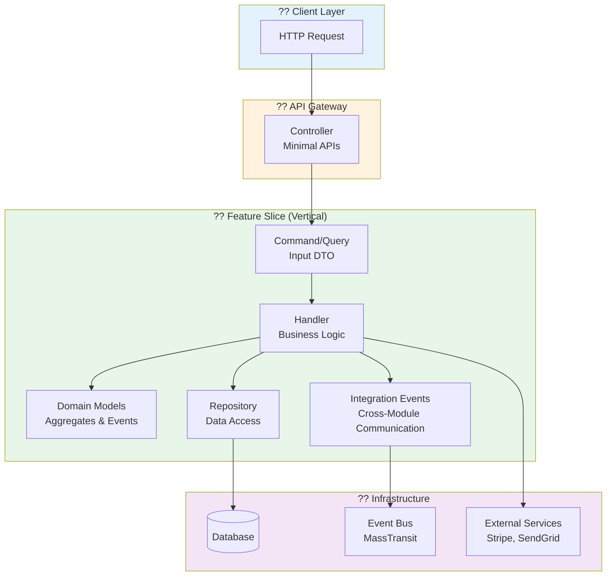
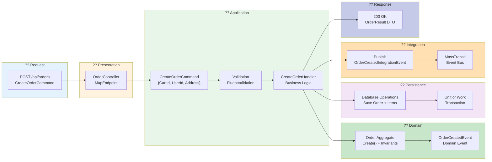
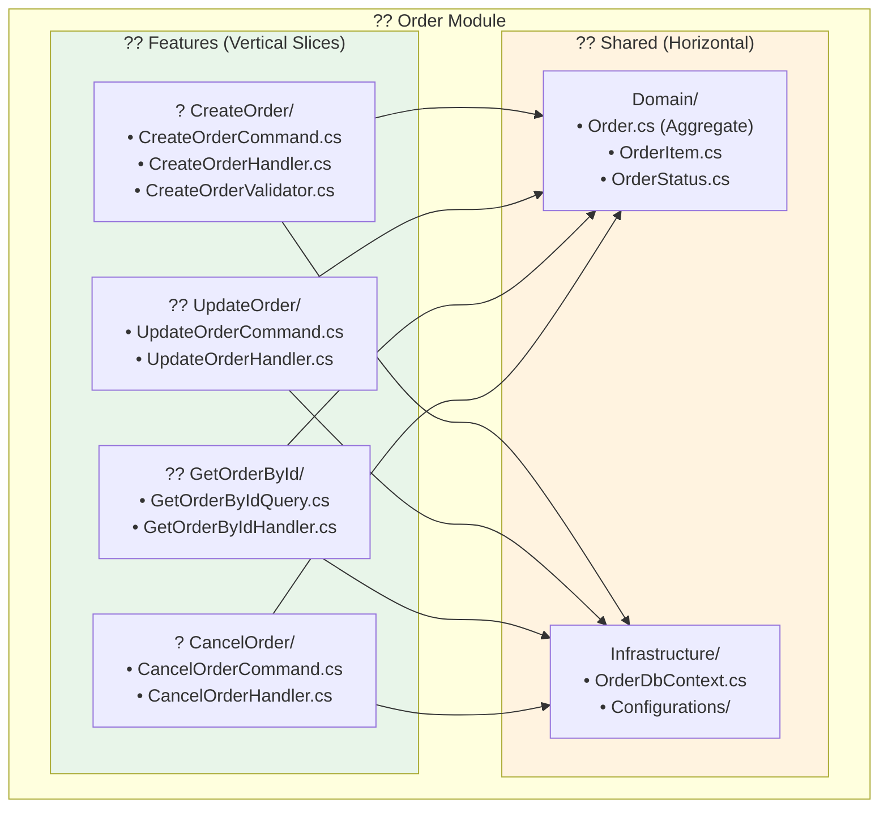
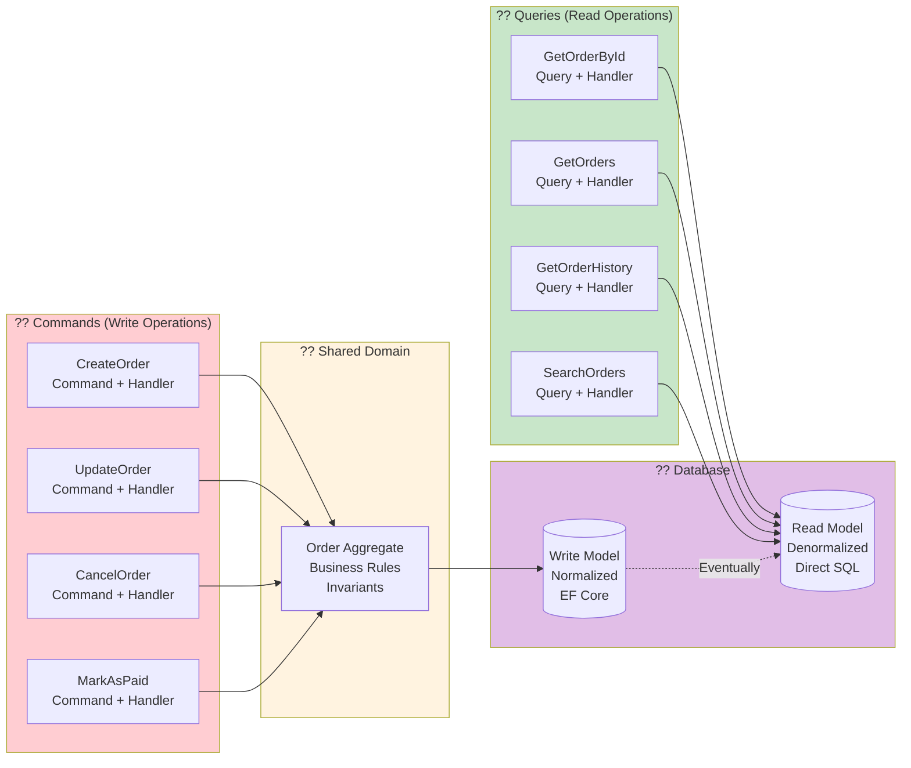
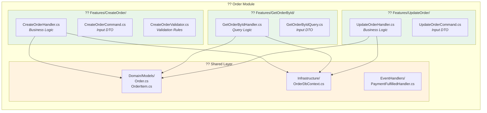
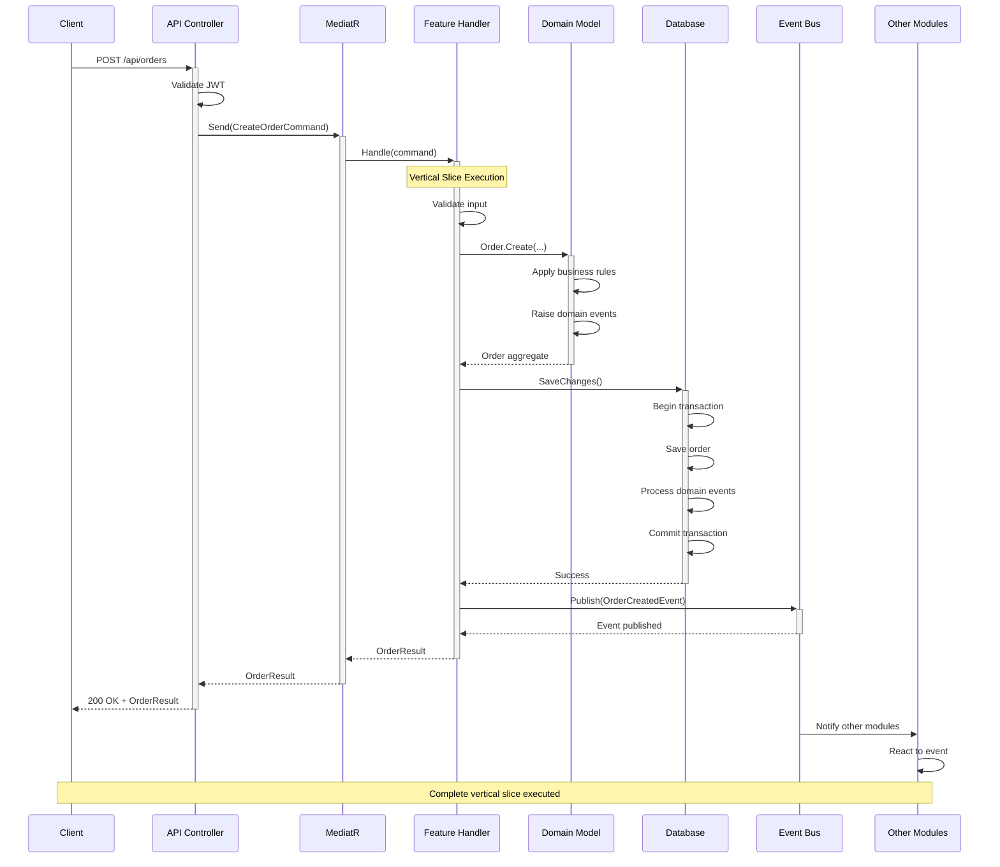
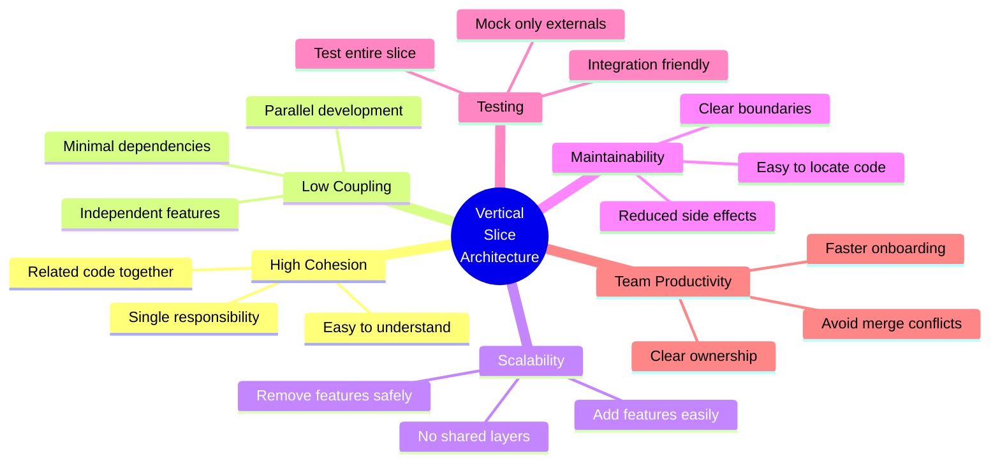
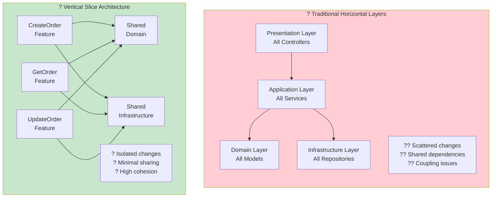

# ??? Vertical Slice Architecture - Store Backend

## ?? Overview

This project implements **Vertical Slice Architecture** where each feature is a complete, independent slice through all architectural layers, promoting high cohesion and low coupling.

## ?? High-Level Architecture



## ?? Vertical Slice Example: Create Order



## ??? Module Structure (Vertical Slices)



## ?? CQRS Vertical Slices



## ?? Vertical Slice File Organization



## ?? Complete Feature Flow (End-to-End)



## ? Key Benefits of Vertical Slices



## ?? Comparison: Vertical vs Traditional Horizontal



## ?? Real Example from Your Project

### **Product Module - Vertical Slices**

```
Product/
??? Application/
?   ??? Features/                     ? Vertical Slices
?   ?   ??? CreateProduct/            ? Complete feature slice
?   ?   ?   ??? CreateProductCommand.cs
?   ?   ?   ??? CreateProductHandler.cs
?   ?   ?   ??? CreateProductValidator.cs
?   ?   ??? GetProductById/           ? Complete feature slice
?   ?   ?   ??? GetProductByIdQuery.cs
?   ?   ?   ??? GetProductByIdHandler.cs
?   ?   ??? UpdateProduct/            ? Complete feature slice
?   ?   ?   ??? UpdateProductCommand.cs
?   ?   ?   ??? UpdateProductHandler.cs
?   ?   ??? DeleteProduct/            ? Complete feature slice
?   ?       ??? DeleteProductCommand.cs
?   ?       ??? DeleteProductHandler.cs
?   ??? EventHandlers/                ? Cross-cutting concerns
?       ??? OrderCreatedHandler.cs
??? Domain/                           ? Shared horizontal layer
?   ??? Models/
?   ?   ??? Product.cs
?   ??? Events/
?       ??? ProductCreatedEvent.cs
??? Persistence/                      ? Shared horizontal layer
    ??? ProductDbContext.cs
    ??? Configurations/
```

## ?? Key Principles

1. **Feature Folders** - Each feature in its own folder
2. **Complete Slice** - All code for a feature together
3. **Minimal Sharing** - Share only domain models and infrastructure
4. **Independent Testing** - Test each slice independently
5. **Easy Discovery** - Find all related code in one place

---

**?? This vertical slice architecture makes your codebase more maintainable, scalable, and developer-friendly!**
